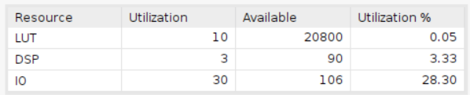

# Binary to BCD (by division)

Using Board Basys3 with 20ns clock period.

**When clock period is 10ns, the design will become sequential circuit due to the latency.**

## Design

This design is to convert the binary number to BCD number by division.

* The binary_in is the input binary number.
* The bcd is the output BCD number.

The vivado design is based on the following diagram:

**Note that the modulus operation is implemented by subtraction, multiplication and division to keep the design combinational.**

## Result comparison

The comparison of the design implemented by HLS and the design implemented by verilog is shown below.The utilization report indicates that the design implemented by verilog is more concise and efficient than the design implemented by HLS.

|Waveform  |        |
|--------|--------|
|HLS     ||
|verilog ||

The result shows that both design convert binary into BCD.

|Utilization||
|--|--|
|HLS||
|verilog||

The main different between the two designs is that the design implemented by HLS uses 3 DSPs while the design implemented by verilog did not use any of DSP. Although the design implemented by HLS uses less LUTs, the DSPs are more expensive than LUTs.