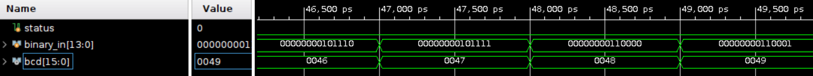
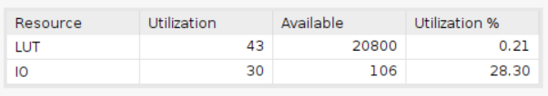

# Binary to BCD (by division)
    Using Board Basys3
## Result comparison
### Utilization
|       | HLS   | verilog   |
| ----- | ----- | --------- |
| LUT   | 75    |   43      |

## HLS synthesis result
### Utilization

### Timing

## Verilog synthesis result
### Design

### Utilization

### Timing
