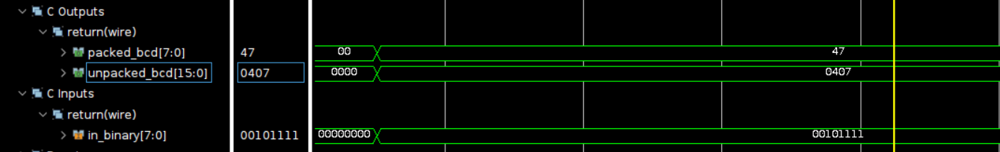

# Binary to BCD (by double dabble)

Using Board Basys3 with 20ns clock period.

**When clock period is 10ns, the design will become sequential circuit due to the latency.**

## Design

This design is to convert the binary number to BCD number by double dabble algorithm.

* The binary_in is the input binary number.
* The bcd is the output BCD number.

The vivado design is based on the following diagram:

## Result comparison

The comparison of the design implemented by HLS and the design implemented by verilog is shown below.The utilization report indicates that the design implemented by verilog is more concise and efficient than the design implemented by HLS.

| Waveform  |        |
|--------|--------|
|HLS     ||
|verilog ||

The result shows that both design are correct. (The testcase input is 00101111 in binary and the output is 47 in decimal.)

|Utilization||
|--|--|
|HLS||
|verilog||
