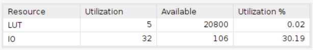

# Binary to BCD (by double dabble)

Using Board Basys3 with 20ns clock period.

**When clock period is 10ns, the design will become sequential circuit due to the latency.**

## Design

This design is to convert the binary number to BCD number by double dabble algorithm.

* The binary_in is the input binary number.
* The bcd is the output BCD number.

The vivado design is based on the double dabble algorithm. The algorithm is shown below:

|   bcd_out    | binary_in |
|----------|----------|
|00000000 | xxxx xxxx|

1. Set the BCD number to 0.
2. Shift the BCD number left by 1 bit.
3. If the BCD number is greater than 4, add 3 to the BCD number.
4. Repeat step 2 to 3 until the binary number is 0.

**In this design(8-bit BCD), we perform 7 times step 2 and step 3 and one more time step 2.**

## Result comparison

The comparison of the design implemented by HLS and the design implemented by verilog is shown below. In this design, the utilization of the structure implemented by HLS and viado is identical.

| Waveform  |        |
|--------|--------|
|HLS     ||
|verilog ||

The result shows that both design are correct. (The input testcase of HLS  consist of one value 00101111 in binary and the output is 47 in BCD.)

|Utilization||
|--|--|
|HLS||
|verilog||

The result shows that the utilization of both design is exactly the same.
