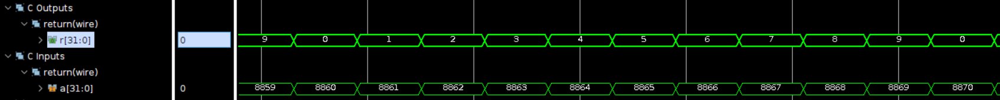
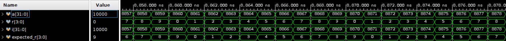
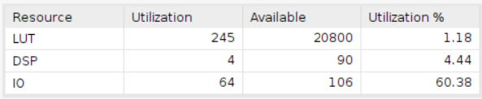
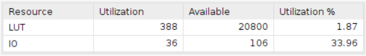

# Interger Division Modulus

Using Board Basys3 with 40ns clock period.

**When clock period is less than 40ns, the design will become sequential circuit due to the latency.**

## Design

The objective of this design is to decrease the latency of the modulus operation by incorporating a division-based modulus approach.

    a % b = a - ( a / b ) * b

* The input data a is the dividend.
* The divisor in this design is 10.
* The output data r is the remainder.

## Result comparison

| Waveform  |        |
|--------|--------|
|HLS     ||
|verilog ||

The simulation assesses the value of the modulus using variable 'a' across the range of 0 to 9999. The screenshot presented here displays only a section of the waveform; nonetheless, the accuracy was validated during the simulation process.

|Utilization||
|--|--|
|HLS||
|verilog||

The HLS design utilizes 4 DSPs and 245 LUTs, whereas the Verilog design employs 388 LUTs. This comparison highlights that the Verilog design is more resource-efficient in terms of utilization.