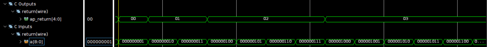
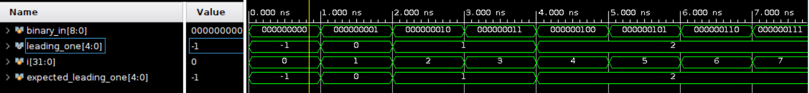
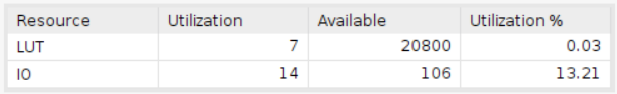
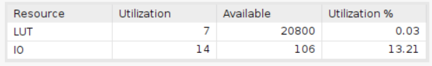

# Leading One Detector

Using Board Basys3 with 20ns clock period.

**When the clock period is set to be below 20ns, the design will transition into a sequential circuit configuration due to the associated latency.**

## Design

The purpose of this design is to identify the position of the leading one in the input binary number.

* The input data, 'binary_in', represents the binary number under consideration.
* The output data, labeled as 'leading_one', indicates the position of the leading one within the input binary number.
**Note that the output is represented as a signed binary to accommodate scenarios where there is no '1' in the binary input. In such cases, the output data 'leading_one' will assume a value of -1.**

The design is constructed using a nested if-else statement, which can be realized through nested multiplexers (MUXes), illustrated as follows:

    if (binary_in[8] == 1)
    {
		index = 8;
	}
    else if (binary_in[7] == 1)
    {
		index = 7;
	} 
    .
    .
    .
    else if (binary_in[0] == 1)
    {
		index = 0;
	}
	else {
		index = -1;
	}

This can be further rephrased for greater conciseness:
    
    leading_one = -5'b1;
        for (i = 0; i <= 8; i = i + 1)
        begin
            if (binary_in[i] == 1)
                leading_one = i;
        end

## Result comparison

The comparison of the design implemented by HLS and the design implemented by verilog is shown below. In this design, the utilization of the structure implemented by HLS and viado is identical.

|Waveform||
|--|--|
|HLS     ||
|verilog ||

The displayed screenshot above only presents a portion of the waveform. Nevertheless, the simulation confirms the design's validity by testing all conceivable values of the 9-bit binary number.

|Utilization||
|--|--|
|HLS||
|verilog||

The results demonstrate that the utilization of both designs is precisely identical.
