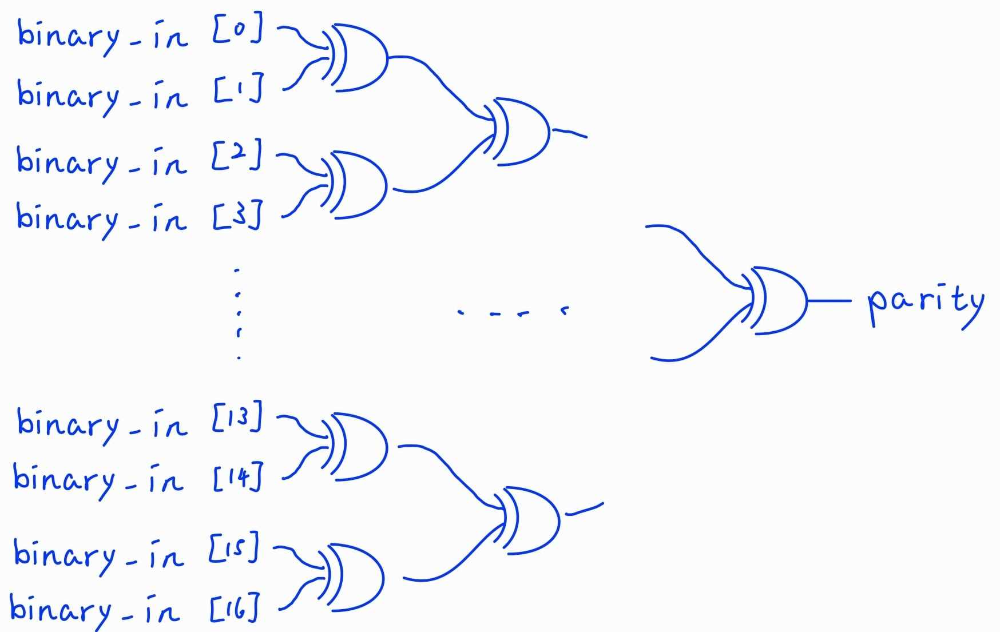

# Parity generator

Employing the Basys 3 board with a clock period of 10ns.

## Design

This design is to generate the parity bit of the input binary number.

* The data binary_in is the input binary number.
* The data parity is the output parity bit.

The vivado design is based on the diagram shown below:

**Note that during Vivado compilation of the for-loop, the design will be implemented with a balanced structure instead of a skewed one.**

## Result comparison

|Waveform||
|--|--|
|HLS||
|verilog||

The screenshot only displays a portion of the results. Nonetheless, the correctness of both designs has been verified through simulation.

|Utilization||
|--|--|
|HLS||
|verilog||

The reports indicate that the utilization is the same in both the HLS-designed and Verilog-designed implementations.