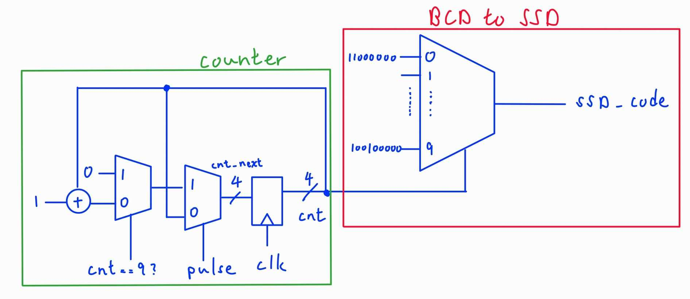
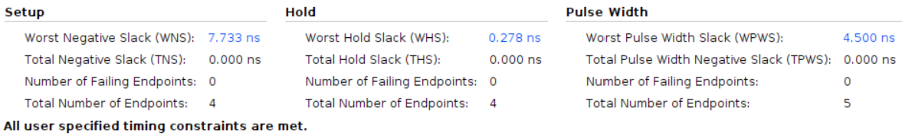
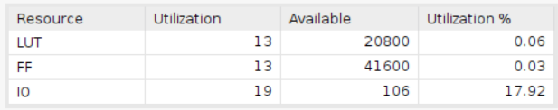

# One Digit BCD counter

Using Board Basys3 with 10ns clock period

## Design

The purpose of this design is to count from 0 to 9 using BCD code and then showcase the count on a seven-segment display.

* Input Signals:
  * **clk**: This signal is the clock input.
  * **rst_n**: This signal is a low-active reset trigger.
  * **pulse**: This signal serves as the enable input for the counter.
* Output Signals:
  * **seven_segment_data**: This signal contains the data to be displayed on the seven-segment display.
  * **seven_segment_display**: This signal determines the specific seven-segment display to be utilized.

## Result comparison

The design implemented by HLS uses twice as much LUTs as the design implemented by verilog and triple the usage of FFs to that of the verilog design.

|Waveform  |        |
|--------|--------|
|HLS     ||
|HLS(pipelined) ||
|verilog ||

|Timing|        |
|--------|--------|
|HLS (pipelined)    ||
|verilog ||

|Utilization|                        |
|--         |--                      |
|HLS (pipelined)| |
|verilog    ||