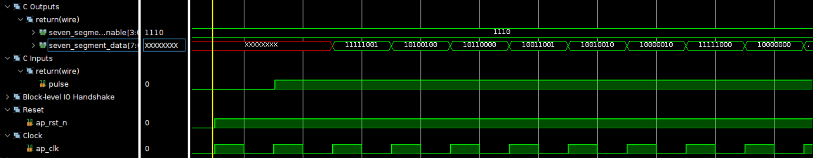
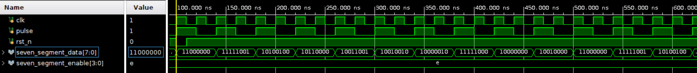

# One Digit BCD counter

    Using Board Basys3
    clock period = 10ns

## Design

## Result comparison

'''The design implemented by HLS uses twice as much LUTs as the design implemented by verilog and triple the usage of FFs to that of the verilog design.'''

|Waveform  |        |
|--------|--------|
|HLS     ||
|HLS(pipelined) ||
|verilog | |

|Timing|        |
|--------|--------|
|HLS (pipelined)    ||
|verilog ||

|Utilization|                        |
|--         |--                      |
|HLS (pipelined)| |
|verilog    ||