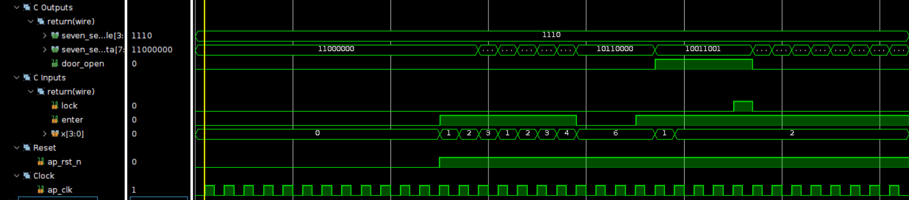
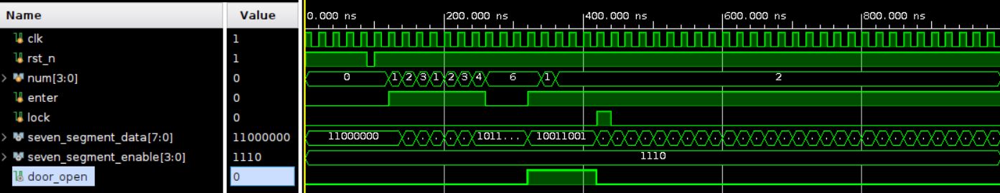
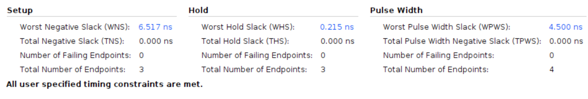

# Combinational Lock

Using Board Basys3 with 10ns clock period

## Design

This design is to implement a combinational lock that requires to input a four-digit password to unlock. The password in this design is **2346**. The lock will be unlocked if the input code is correct. Otherwise, the lock will be locked. After the door is open, press lock button to lock the door again.

* Input Signals:
  * **clk**: This signal is the clock input.
  * **rst_n**: This signal is a low-active reset trigger.
  * **num**: This signal is the input number, which will be controlled by switch in the design.
  * **enter**: This signal is to enter the number selected.
  * **lock**: This signal is the lock button.
* Output Signals:
  * **seven_segment_data**: This signal is to show the user about the current state.
  * **seven_segment_enable**: This signal is to enable the seven segment display.
  * **door_open**: This signal is to show the user about the current state of the door.

## Result comparison

|Waveform||
|--------|--------|
|HLS||
|verilog||

|Utilization||
|--|--|
|HLS||
|verilog||

|Timing||
|--------|--------|
|HLS||
|verilog||