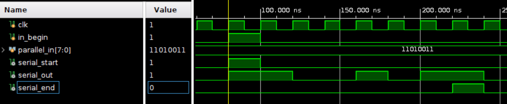
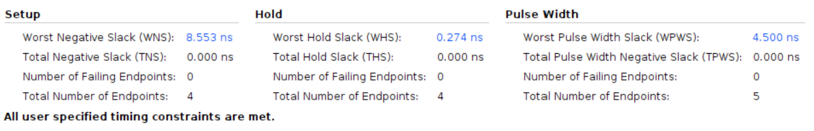

# Parallel to Serial

** Using Board Basys3 with 10ns clock period

## Design

This design is to convert the parallel data to serial data.

* The input datas are the clk, in_begin, and the parallel_in.
  * The clk is the clock signal.
  * The in_begin  is the signal that indicates the start of the input, which acts as the reset signal.
  * The parallel_in is the input data.
* The output datas are the serial_out, serial_start, and  serial serial_end.
  * The serial_out is the output data.
  * The serial_start is the signal that indicates the start of the output.
  * The serial_end is the signal that indicates the end of the output.

The vivado design is based on the following diagram:

## Result comparison

The comparison of the design implemented by HLS and the design implemented by verilog is shown below.All imformations point out that the design implemented by verilog is more concise and efficient than the design implemented by HLS.

|Waveform  |        |
|--------|--------|
|HLS     ||
|verilog ||

We can easily see that both design acts the same from the waveform.

|Utilization|                        |
|--         |--                      |
|HLS        | |
|verilog    |  |

However, the design implemented by HLS uses a great amount of LUTs and FFs than the design implemented by verilog.

|Timing||
|--|--|
|HLS||
|verilog||

By timing report, we can find out that the design implemented by verilog has bigger slack than the design implemented by HLS, this might come from the reduncdant design implemented by HLS.
