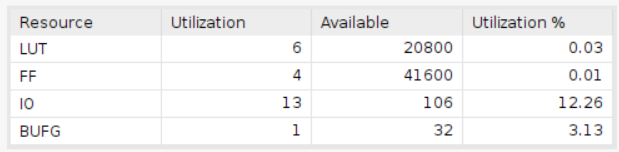

# One Digit BCD counter

    Using Board Basys3
    clock period = 10ns

## Design

## Result comparison

'''   '''

|Waveform  |        |
|--------|--------|
|HLS     ||
|verilog | |

|Utilization|                        |
|--         |--                      |
|HLS        | |
|verilog    | |

|Timing||
|--|--|
|HLS||
|verilog||