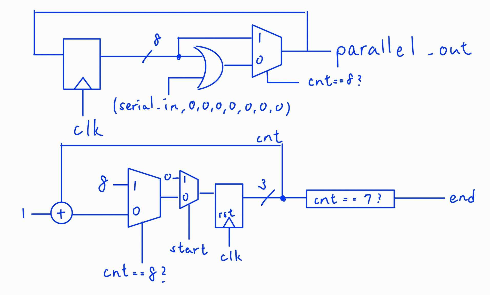
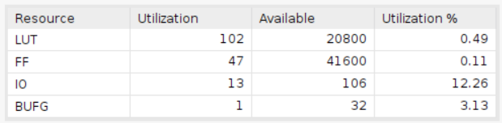

# One Digit BCD counter

    Using Board Basys3
    clock period = 10ns

## Design

## Result comparison

'''The design implemented by HLS uses six times as much LUTs as the design implemented by verilog and about four times the usage of FFs to that of the verilog design.'''

|Waveform  |        |
|--------|--------|
|HLS     ||
|verilog ||

|Utilization|                        |
|--         |--                      |
|HLS        ||
|verilog    ||