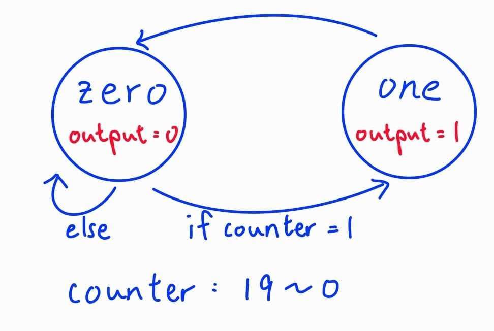
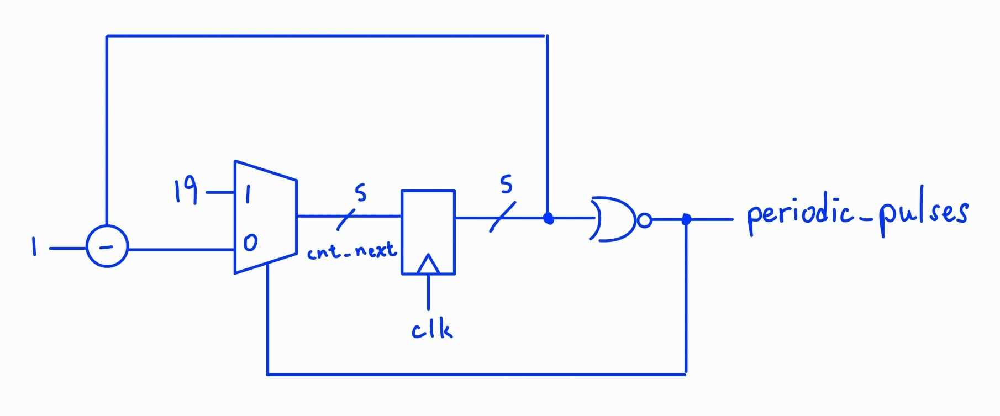
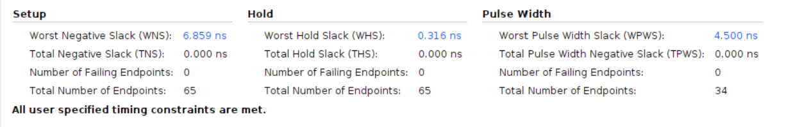
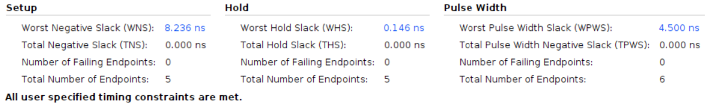
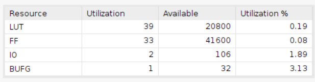
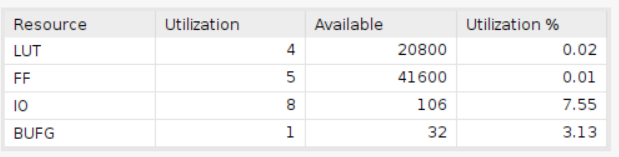

# Single Cycle Regular Pulses

    Using Board Basys3
    clock period = 10ns

|Design||
|--|--|
|HLS||
|verilog||

## Result comparison

''' As we can see,the setup time and the hold time of verilog is close. However, the utilization of HLS design is much higher than the verilog design. The HLS design cost 39 LUTs while the verilog design only needs 4 LUTs. On the otherhand, the verilog design uses 5 FFs while the HLS design needs 33 FFs. Note that the IO difference between HLS design and the verilog design due to the reason that I declare the wire variable as an ouput in verilog design for the purpose of debugging.'''

|Timing  |        |
|--------|--------|
|HLS     ||
|verilog ||

|Utilization|                        |
|--         |--                      |
|HLS        |  |
|verilog    ||