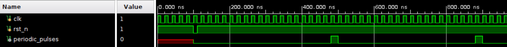

# Single Cycle Regular Pulses

Using Board Basys3 with 10ns clock period.

## Design

This design is to generate a regular pulse every 20 clock cycles.

* The input datas are the clk, rst_n.
  * The clk is the clock signal.
  * The rst_n is a low active reset signal.
* The output data is the periodic_pulses.

The vivado design is based on the following diagram:

## Result comparison

|Waveform||
|--|--|
|HLS||
|verilog||

The waveform shows that both design acts the same.

|Utilization|                        |
|--         |--                      |
|HLS        ||
|verilog    ||

The utilization of HLS design is much higher than the verilog design. The HLS design cost 39 LUTs while the verilog design only needs 4 LUTs. On the otherhand, the verilog design uses 5 FFs while the HLS design needs 33 FFs.

|Timing  |        |
|--------|--------|
|HLS     ||
|verilog ||

As we can see, the setup slack and the hold slack of the design implemented by verilog is larger than that of the HLS design, which indicates that the verilog design is more concise.
