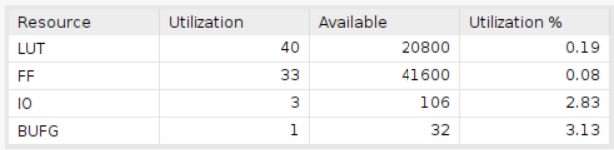
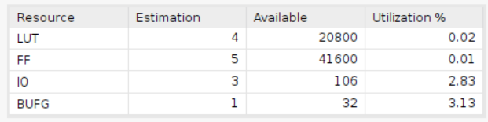

# Single Cycle Regular Pulses
    Using Board Basys3
    clock period = 10ns
## Result comparison
''' As we can see, the result of HLS and verilog are the same. '''
|Timing||
|--------|--------|
|HLS||
|verilog||

|Utilization||
|--|--|
|HLS||
|verilog||

### Design plot for verilog
