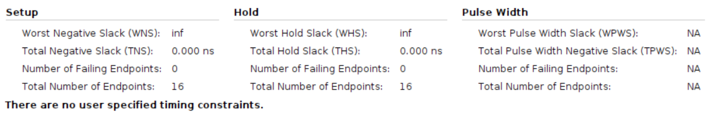

# Single Cycle Regular Pulses
    Using Board Basys3
    clock period = 10ns
## Result comparison
|Timing||
|--------|--------|
|HLS||
|verilog||

|Utilization||
|--|--|
|HLS||
|verilog||
### Design
