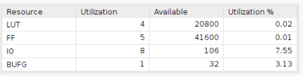

# Single Cycle Regular Pulses
    Using Board Basys3
## Result comparison
### Utilization
|       | HLS   | verilog   |
| ----- | ----- | --------- |
| LUT   | 93    |      4    |
| FF    | 34    |      5    |

## HLS synthesis result
### Utilization

### Timing

## Verilog synthesis result
### Design
### Utilization

### Timing
