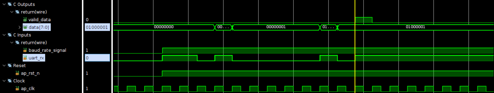
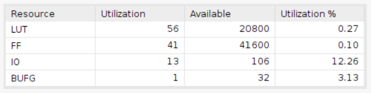
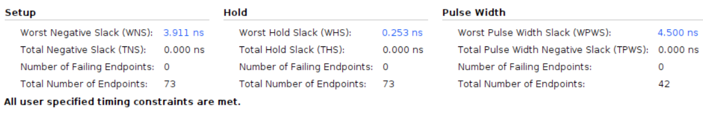

# UART Receiver

This design is to create an UART receiver. An UART receiver facilitates serial communication by converting a synchronized bit stream into parallel data. It removes the start and stop bits to extract the data frames, enabling clock-independent data transfer between devices.

## Design

* Input signals
  * `clk`: This signal is the clock signal.
  * `rst_n`: This signal is the active low reset signal.
  * `baud_rate_signal`: This signal is the baud rate signal.
  * `rx`: This signal represents the serial input data, encompassing the start signal, the input parallel data, and the stop signal.
* Output signals
  * `data`: This signal represents the parallel data output.
  * `valid`: This signal represents the valid signal.

The design is based on the following FSM:

| Waveform design |      |          |    |    |    |    |    |    |    |    |         |      |
|-----------------|:----:|:--------:|:--:|:--:|:--:|:--:|:--:|:--:|:--:|:--:|:-------:|:----:|
| rx              |   1  | 0(start) | D0 | D1 | D2 | D3 | D4 | D5 | D6 | D7 | 1(stop) |   1  |
| state           | idle |  receive |  - |  - |  - |  - |  - |  - |  - |  - |   idle  | idle |
| cnt             |   X  |     0    |  1 |  2 |  3 |  4 |  5 |  6 |  7 |  8 |    9    |   X  |
| valid           | 0    | 0        | 0  | 0  | 0  | 0  | 0  | 0  | 0  | 0  | 1       | 0    |

## Result Comparison

|Waveform||
|--|--|
|HLS||
|Verilog||

|Utilization||
|--|--|
|HLS||
|Verilog||

|Timing||
|--|--|
|HLS||
|Verilog||
