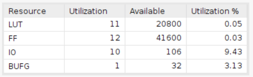

# Vending Machine

Employing the Basys 3 board with a clock period of 10ns.

## Design

The objective of this design is to create a vending machine that dispenses candy priced at twenty-five cents. This vending machine accommodates nickels, dimes, and quarters as acceptable coins. Upon the user inserting the appropriate amount of money, the machine dispenses the candy and returns any surplus change. Subsequently, once the user takes the candy, the machine transitions into a waiting state, ready for the next purchase.

* Input Signals:
  * **clk**: This signal is the clock input.
  * **rst_n**: This signal is a low-active reset trigger.
  * **nickel_in**: This signal represents the nickel input.
  * **dime_in**: This signal represents the dime input.
  * **quarter_in**: This signal represents the quarter input.
  * **thanks_in**: This signal represents the user taking the candy.
* Output Signals:
  * **candy_out**: This signal represents the candy output.
  * **nickel_out**: This signal represents the nickel output.
  * **dime_out[0]**: This signal represents the dime output.
  * **dime_out[1]**: This signal represents the other dime output.

The design is based on the FSM below:

## Result comparison

|waveform||
|--------|--------|
|HLS||
|verilog||

|Utilization||
|--|--|
|HLS||
|verilog||

|Timing||
|--|--|
|HLS||
|verilog||
