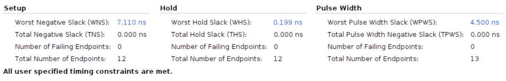

# Vending Machine

Employing the Basys 3 board with a clock period of 10ns.

## Design

The objective of this design is to create a vending machine that dispenses candy priced at twenty-five cents. This vending machine accommodates nickels, dimes, and quarters as acceptable coins. Upon the user inserting the appropriate amount of money, the machine dispenses the candy and returns any surplus change. Subsequently, once the user takes the candy, the machine transitions into a waiting state, ready for the next purchase.

* Input Signals:
  * `clk`: This signal is the clock input.
  * `rst_n`: This signal is a low-active reset trigger.
  * `nickel_in`: This signal represents the nickel input.
  * `dime_in`: This signal represents the dime input.
  * `quarter_in`: This signal represents the quarter input.
  * `thanks_in`: This signal represents the user taking the candy.
* Output Signals:
  * `candy_out`: This signal represents the candy output.
  * `nickel_out`: This signal represents the nickel output.
  * `dime_out[0]`: This signal represents the dime output.
  * `dime_out[1]`: This signal represents the other dime output.

The design is based on the FSM below:

## Result comparison

The results indicate that the HLS design exhibits greater slack in both setup and hold times. Furthermore, it's worth noting that the HLS design employs significantly fewer flip-flops compared to the Verilog design, which is an unexpected outcome.**The reason is still unclear and requires clarification.**

|waveform||
|--------|--------|
|HLS||
|verilog||

The waveform illustrates that both designs are indistinguishable and fulfill their intended functions. The testbench simulates a scenario in which the user inserts two dimes and one quarter. The output confirms that the vending machine successfully dispenses the candy and returns the extra change.

|Utilization||
|--|--|
|HLS||
|verilog||

There is a noticeable discrepancy between the HLS-designed and Verilog-designed implementations regarding flip-flop (FF) utilization. The HLS design utilizes only a third of the FFs compared to the FF usage in the Verilog design. Upon inspecting the schematic in Vivado, I determined that this variance stems from Vivado's optimization of the state machine through one-hot encoding in the Verilog design. While one-hot encoding leads to significant FF usage, it concurrently reduces logic delay and enhances the design's overall performance. **However in my design, the slack isn't larger than the HLS design. The reason is still unclear and requires clarification.**

|Timing||
|--|--|
|HLS||
|verilog||

As shown above, the HLS design has larger slack in both setup time and hold time. **The reason is still unclear and requires clarification.**
